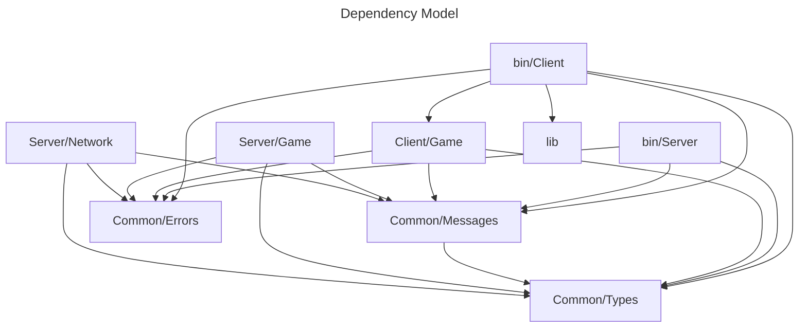

# A networking template for video game servers written in Rust, with client-server architecture, real-time synchronisation, and physics simulation.<br/>
Clients can be written in any language. Free for use in your projects.<br/>
This is not a swiss army knife, but a chassis for you to build upon.

## Getting Started
#### Prerequisites

Rust 1.70 or higher

#### Installation
Clone the repository:
```bash
git clone https://github.com/KyleDunbarDev/networking_basic.git
cd networking_basic
```

#### Running

Start the server:
```bash
cargo run --bin server
```
In another terminal, start a client:
```bash
cargo run --bin client -- --client-id 0
```
For debug visualization, add the debug flag:
```bash
cargo run --bin client -- --client-id 0 --debug
```
### Debugging
#### Running Tests
```bash
cargo test -- --nocapture
```

#### Debug Mode
Start client with --debug flag to see:

- Connection status
- Player position
- Velocity
- Other players' information


## Features
#### Core Architecture

- Server-client model using TCP
- JSON messages for communication
- Non-blocking I/O with multiple threads
- Message passing between components using channels

#### Server Features

- Handles multiple client connections
- Game state management and updates
- Physics simulation (movement and collisions) (example use)
- Map bounds enforcement (example use)
- Broadcasts state updates to all clients
- Fixed timestep

#### Client Features (example use)

- Connects to server with retry logic
- Sends movement commands
- Receives and processes game state updates
- Debug visualization and logging
- CLI debug mode

#### Testing Infrastructure

- Unit tests for game logic
- Network tests with test server/client
- Logging system using tracing
- Debug visualization for game state

#### Message Types

Client → Server:

- Join
- Move (with direction vector)
- Disconnect


Server → Client:

- JoinAccepted
- GameState (with player positions)
- Error messages


#### Data Types

- Vector2 for positions and velocities
- PlayerState with position/velocity
- GameState with collection of players
- Timestamp handling

#### Potential Features not implemented

- Heartbeat/Connection monitoring
- Message sequencing and reliability
- Client-side prediction
- State interpolation
- Error recovery
- Connection recovery
- Network latency compensation

# Developer documentation
Below is documentation to help you use and understand this networking starter piece. <br/>
<br/>
Client (client/game & bin/client) is an example for a game and can be fully swapped out for any executable of your choosing. <br/><br/>
For client - server interoperability, send serialised messages to the server that be can deserialised into ClientMessage types.
Serlialisation in the server is in JSON but this can be swapped easily for serialisation of your choice.

## Architecture
#### Server Resonsibilities

- Manages game state
- Handles client connections
- Processes player inputs
- Simulates physics
- Broadcasts state updates

#### Client Responsibilities

- Connects to server
- Sends player inputs
- Receives and processes state updates
- Provides debug visualization
- Other responsibilities of your choice e.g. Client-side prediction

#### Network Protocol
Messages are JSON-encoded and newline-terminated.


## Project Structure
```
src/
├── bin/
│   ├── client.rs    # Client binary
│   └── server.rs    # Server binary
├── client/
│   ├── game.rs      # Client game logic
│   └── network.rs   # Client networking
├── server/
│   ├── game.rs      # Server game logic
│   └── network.rs   # Server networking
├── common/          # Shared types and utilities
├── lib.rs           # Logging implementation
└── main.rs
```

### Stability

To suit your needs, components are grouped foremost with Single Responsibility Principle for ease of change.



# API Documentation

## Game Client API

### GameClient
Main client interface for connecting to and interacting with the game server.

#### Methods

```rust
pub fn new(address: &str) -> Result<Self>
```
Creates a new game client connection.
- `address`: Server address in format "ip:port"
- Returns: Result containing GameClient instance

```rust
pub fn connect(&mut self) -> Result<()>
```
Establishes connection with server.
- Returns: Result indicating success/failure

```rust
pub fn move_player(&mut self, direction: Vector2) -> Result<()>
```
Sends movement command to server.
- `direction`: Movement vector
- Returns: Result indicating success/failure

```rust
pub fn update(&mut self) -> Result<()>
```
Updates client state with latest server information.
- Returns: Result indicating success/failure

```rust
pub fn get_player_state(&self, player_id: &str) -> Option<&PlayerState>
```
Gets state of specific player.
- `player_id`: ID of player to query
- Returns: Optional reference to player state

```rust
pub fn debug_info(&self) -> String
```
Gets formatted debug information about client state.
- Returns: Debug information string

## Game Server API

### GameServer
Main server implementation handling game state and client connections.

#### Methods

```rust
pub fn new(address: &str) -> Result<Self>
```
Creates new game server instance.
- `address`: Address to bind to
- Returns: Result containing GameServer instance

```rust
pub fn run(&mut self) -> Result<()>
```
Starts the server main loop.
- Returns: Result indicating success/failure

## Common Types

### Vector2
```rust
pub struct Vector2 {
    pub x: f32,
    pub y: f32,
}
```
Represents 2D vector for position and movement. Serialisable.

### PlayerState
```rust
pub struct PlayerState {
    pub position: Vector2,
    pub velocity: Vector2,
    pub last_update: Timestamp,
}
```
Represents current state of a player.

## Network Protocol

### Client Messages
```rust
pub enum ClientMessage {
    Join,
    Move { direction: Vector2 },
    Disconnect,
}
```

### Server Messages
```rust
pub enum ServerMessage {
    JoinAccepted { player_id: String },
    GameState(GameStateUpdate),
    Error { message: String },
}
```

### Message Format
All messages are JSON-encoded and terminated with a newline character.

Example Join message:
```json
{"type":"Join"}\n
```

Example Move message:
```json
{"type":"Move","direction":{"x":1.0,"y":0.0}}\n
```

# License
This project is licensed under the MIT License - see the LICENSE file for details.
