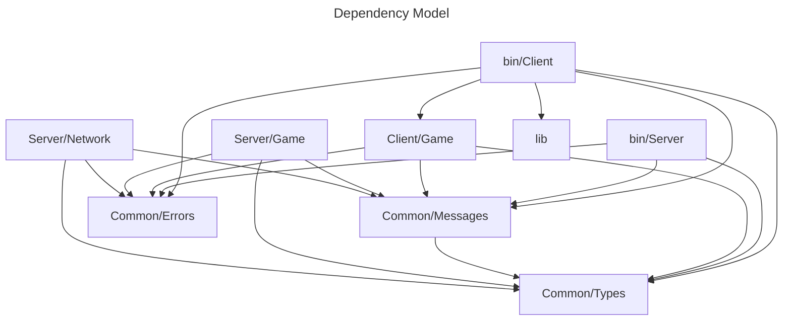

# Developer documentation
Below is documentation to help you use and understand this networking starter piece.  
This is not a swiss army knife, but a chassis for you to build upon.  
Client (client/game & bin/client) is an example for a game and can be fully swapped out for any executable of your choosing.   
For client - server interoperability, send serialised messages to the server that be can deserialised into ClientMessage types.
Serlialisation in the server is in JSON but this can be swapped easily for serailisation of your choice.

# Stability

