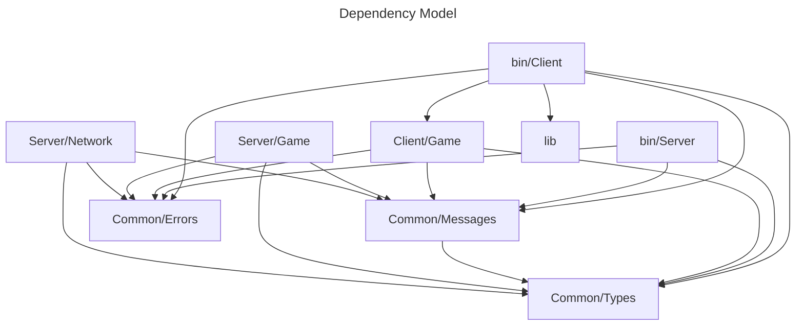

# Developer documentation
Below is documentation to help you use and understand this networking starter piece.  
This is not a swiss army knife, but a chassis for you to build upon.  
Client (client/game & bin/client) is an example for a game and can be fully swapped out for any executable of your choosing.   
For client - server interoperability, send serialised messages to the server that be can deserialised into ClientMessage types.
Serlialisation in the server is in JSON but this can be swapped easily for serailisation of your choice.

# Features
#### Core Architecture

- Server-client model using TCP
- JSON messages for communication
- Non-blocking I/O with multiple threads
- Message passing between components using channels

#### Server Features

- Handles multiple client connections
- Game state management and updates
- Physics simulation (movement and collisions) (example use)
- Map bounds enforcement (example use)
- Broadcasts state updates to all clients

#### Client Features (example use)

- Connects to server with retry logic
- Sends movement commands
- Receives and processes game state updates
- Debug visualization and logging
- CLI debug mode

#### Testing Infrastructure

- Unit tests for game logic
- Network tests with test server/client
- Logging system using tracing
- Debug visualization for game state

#### Message Types

Client → Server:

- Join
- Move (with direction vector)
- Disconnect

Server → Client:

- JoinAccepted
- GameState (with player positions)
- Error messages

#### Data Types

- Vector2 for positions and velocities
- PlayerState with position/velocity
- GameState with collection of players
- Timestamp handling

#### Potential Features not implemented

- Heartbeat/Connection monitoring
- Message sequencing and reliability
- Client-side prediction
- State interpolation
- Error recovery and reconnection
- Network latency compensation

# Stability

